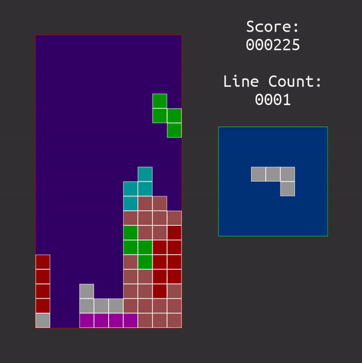

# myo_tetris

University project for the Human-Computer Interface module.

A very basic implementation of the classic tetris game with support for the Myo Armband.

Myo Armband is a (discontinued) gesture recognition device made by Thalmic Labs. It is equipped with electromyographic sensors, gyroscope, accelerometer, magnetometer and thus is capable of providing data about various hand/arm movements and arm/device orientation in space.

The Myo API can be used in two different ways:
* OO: you have to inherit from `DeviceListener` class and implement its methods to receive the input.
* C-style/function API: it's a low level API, so you have to do the polling yourself. That means that you either write some threaded code yourself (and don't skip over input) or you don't poll the whole time and lose some input information.

I chose the second API style, but implemented it sloppily - didn't create a separate thread for the poll. Instead spent a small part of the frame waiting for the input. It's dirty and incorrect and potentially skips over some of the inputs, but at the time the tradeoff seemed to be worth it. Also, the game itself has got a couple of bugs that I didn't bother searching for and fixing.

Done using SDL 2.0.9 and Myo SDK 0.9.0.

